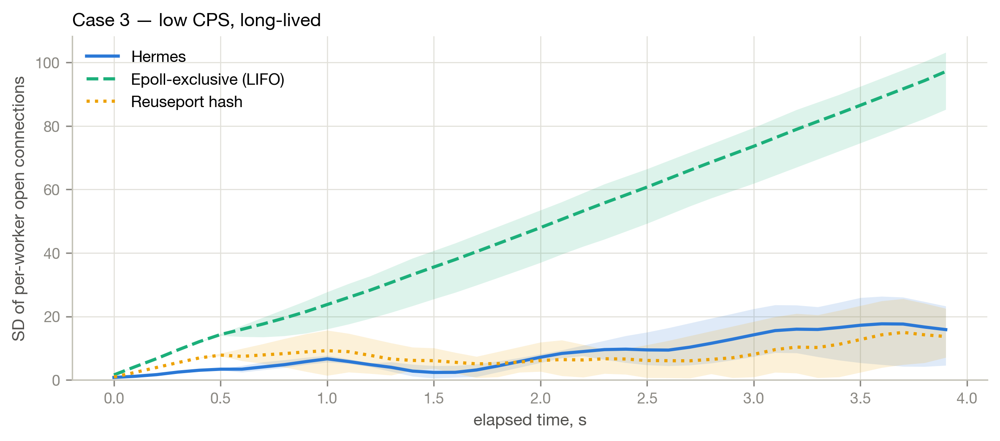

# Micro-Hermes

**An open-source Rust reimplementation of Hermes, the eBPF connection dispatcher inside Alibaba Cloud's Layer 7 load balancers, built from its published description alone.**

A Layer 7 load balancer (HAProxy, NGINX, Envoy) runs one worker process per CPU core, and the Linux kernel decides which worker accepts each new connection. Linux offers two ways to make that decision: `epoll`'s exclusive wakeup, and `SO_REUSEPORT`'s stateless hash. Neither knows anything about how busy each worker is. Because L7 work varies in cost by orders of magnitude (a TLS handshake versus a keep-alive ping) and connections can never migrate once accepted, that blindness concentrates load on a few workers, inflates tail latency, and keeps routing traffic to workers that have hung. Alibaba Cloud [report a production incident](https://doi.org/10.1145/3718958.3750469) where one stuck worker dragged request latency from 30 ms to 440 seconds while the kernel kept feeding it new connections.

Hermes (Pan et al., 2025) is their fix, and it closes the loop across the kernel/userspace boundary:

1. Each worker publishes its live status (open connections, pending events, last-loop timestamp) into a lock-free shared **Worker Status Table**.
2. A scheduler embedded in every worker runs three cascading filters over that table and publishes the surviving **candidate workers** as a bitmap.
3. A small **eBPF program inside the kernel**, attached via `SO_ATTACH_REUSEPORT_EBPF`, reads that bitmap on every incoming connection and steers it to a candidate.

In production it cut daily worker hangs by 99.8% and infrastructure unit cost by 18.9%. Hermes is closed-source, so none of that could be independently verified, and nobody outside Alibaba could use it. This project rebuilds the architecture in the open, in Rust, and tests whether the paper's claims reproduce.

It was my MSc dissertation at the University of St Andrews (Computer Science MSc, 2026); the full write-up is [dissertation.pdf](dissertation.pdf).

## Results

Three dispatch policies (Hermes, `SO_REUSEPORT` hash, epoll exclusive) run across the paper's four traffic regimes plus a fifth of my own, at three load levels, three trials each, over four workers.

- **Balance.** Under low-rate long-lived connections, the pattern that dominates Alibaba's real traffic, epoll exclusive's imbalance grows without bound (SD of 103.5 open connections per worker) while Hermes holds it near zero (5.4), an order-of-magnitude improvement that reproduces the paper's headline result.
- **Hung workers.** With a 400 ms stall injected into one worker, the time filter evicts it inside its 200 ms threshold and readmits it once it recovers, with no dedicated scheduler process to fail.
- **Tail latency.** Hermes beats the stateless hash whenever workers are busy or stalled, and the margin widens with load. It holds the best p99 under sustained overload.
- **A cost the paper only reports as a percentage.** Publishing the candidate bitmap is one memory store in the simulation but a *system call per event-loop iteration* against a real kernel. Under a high rate of very cheap connections that cost exceeds the value of the information and inverts the ranking entirely: the architecture is worth paying for when work is expensive, variable, or long-lived, and not when it is cheap and uniform. This is reported as measured, not tuned away.
- **A conclusion the simulation got wrong.** Building the same design twice made it possible to test the simulation's own reasoning against a real kernel; one of its explanations did not survive. That correction is the strongest argument for carrying a replication through to a working system instead of stopping at a model. See §8.6 of the dissertation.

Eight machine-checkable predicates were written down from the paper *before* any benchmark was run. All eight hold for the simulation; seven of eight hold against the real kernel, and the one that misses (a 1.40x tail-latency advantage where 1.5x was required) is reported as failing rather than quietly re-calibrated.

## The two versions

The same design is implemented twice, split exactly at the real system's kernel/userspace boundary. Everything that lives in userspace in the real system, the Worker Status Table, the scheduler and its filters, the dispatcher's selection logic, and all five traffic scenarios, is **shared code**. What differs is what sits underneath.

### The eBPF version (`hermes/`, `hermes-ebpf/`, `hermes-common/`, `hermes-bench/`)

The real thing, and the main deliverable. Connections arrive over a real TCP port from a separate load generator, each worker owns a real listening socket, and the dispatch decision is made by an eBPF program running inside the kernel, consulted on every completed handshake and communicating with userspace through two eBPF maps. Built with [Aya](https://aya-rs.dev/), and the dispatcher passes the kernel's verifier: no heap allocation, no unbounded loops, and Linux's own `reciprocal_scale` reimplemented exactly.

Critically, the two baselines here are *not models*. They are the operating system itself, selected purely by how the listening sockets are set up: one socket per worker for reuseport, one shared socket with `EPOLLEXCLUSIVE` for exclusive wakeup. The baseline numbers are measurements of Linux. Requires Linux.

### The userspace simulation (`userspace_simulation/`)

Built first, and the reason the eBPF version could be written at all. A parent process stands in for the operating system: it generates synthetic connection arrivals, runs the dispatch logic, and places each connection into the chosen worker's shared-memory ring buffer, where four forked child processes act as the workers. Both baselines are hand-written models of the kernel's behaviour.

It runs on any Unix-like system with no privileges, no kernel version requirement and one dependency (`libc`), which makes the feedback loop and the whole evaluation harness inspectable and cheap to experiment with. Because the dispatcher was written from the start under the restrictions the verifier imposes, it could later be *moved* into the kernel rather than rewritten for it.

In both versions a worker "processes" a connection by sleeping for that connection's assigned cost, so cost is a property of the connection rather than the worker, matching how real L7 work behaves. That keeps the traffic model identical across both, and is also the evaluation's main limitation: neither version can reproduce the paper's CPU-overhead ratios, since the processor is idle while it sleeps.

## Repository layout

| Path | What it is |
|---|---|
| `hermes/` | The load balancer: workers, event loops, scheduler, WST, eBPF loader |
| `hermes-ebpf/` | The kernel program (the dispatcher, Algorithm 2) |
| `hermes-common/` | Types and constants shared between kernel and userspace |
| `hermes-bench/` | Load generator: opens real connections, sends each request's cost, times the round trip |
| `benchmark/` | Benchmark matrix scripts for the eBPF version |
| `userspace_simulation/` | The standalone simulation, plus its own analysis output |
| `analysis/` | Jupyter analysis pipeline, figures and tables |
| `dissertation.pdf` | The full write-up |
| `TESTING_SUMMARY.md` | What is covered by unit tests, whole-system predicates, and pipeline integrity checks |

## Usage

The two versions are built and run separately: the simulation runs on any Unix-like system, while the eBPF version requires Linux, because it loads a program into the kernel.

### Part 1: The simulation

Requirements. A stable Rust toolchain; the analysis pipeline additionally needs Python 3 with pandas, numpy, matplotlib and Jupyter.

Building and running a single simulation, from the `userspace_simulation/` directory:

    cargo run --release

Configuration is via environment variables:

    POLICY         hermes | lifo | reuseport      (default: hermes)
    WORKLOAD_CASE  1 | 2 | 3 | 4 | 5 | default    (default: default)
    LOAD           light | medium | heavy         (default: the
                   case's characteristic level)
    SEED           integer; varies the connection stream between
                   trials	              (default: 0)
    METRICS_PATH   per-iteration tick CSV   (default: metrics.csv)
    CONNS_PATH     per-connection CSV       (default: conns.csv)
    VERBOSE        1 to print every worker loop iteration

For example, the overloaded compression-heavy case under the Hermes policy:

    POLICY=hermes WORKLOAD_CASE=2 LOAD=heavy cargo run --release

Each run prints a summary and writes the two CSVs. Unit tests run with `cargo test`.

The full benchmark matrix (3 policies × {4 cases × 3 load levels + Case 5} × 3 trials, 8 minutes) is driven by `userspace_simulation/analysis/run_benchmarks.sh`, which writes per-run CSVs into its `results/` directory, skipping existing files so an interrupted run can be resumed.

### Part 2: The eBPF version

Requirements. Linux (developed on current Ubuntu). Beyond the Rust toolchain, compiling the kernel program needs the nightly toolchain with `rust-src` and the `bpf-linker` tool:

    rustup toolchain install nightly --component rust-src
    cargo install cargo-binstall && cargo binstall bpf-linker

Loading a program into the kernel requires administrator privileges, so the benchmark scripts start the load balancer under `sudo` for every policy.

Building both binaries from the repository root:

    cargo build --release -p hermes -p hermes-bench

Running one benchmark point end to end (starts the load balancer, runs the load generator against it, shuts it down):

    benchmark/run_case.sh <policy> <case> <load> <trial>

The full matrix, matching the simulation's:

    benchmark/run_all.sh          # 3 trials
    TRIALS=5 benchmark/run_all.sh # more trials for tighter error bars

Results are written to `benchmark/results/`: per-connection records from the load generator plus per-iteration records from each worker.

### Part 3: Regenerating figures and tables

    cd analysis && jupyter lab hermes_analysis.ipynb
    # then: Kernel → Restart & Run All

The notebook regenerates all figures (`analysis/figures/`) and tables (`analysis/tables/`) from whichever results directory its `RESULTS_DIR` points at: the simulation's `results/` for the simulation, `benchmark/results/` for the eBPF version. The output paths are shared, so regenerating one version's artefacts overwrites the other's unless the output is redirected.

## Reference

Pan, T. et al. (2025) *Hermes: Enhancing Layer-7 Cloud Load Balancers with Userspace-Directed I/O Event Notification.* ACM SIGCOMM '25, Coimbra, Portugal. [doi:10.1145/3718958.3750469](https://doi.org/10.1145/3718958.3750469)

This project is an independent reimplementation from the publication alone; no proprietary Alibaba code, data or material was used or available.

Licensed under MIT or Apache-2.0.
